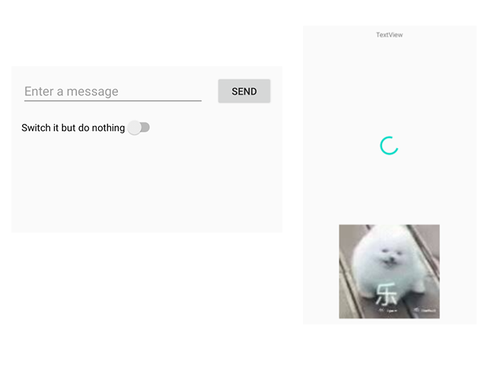
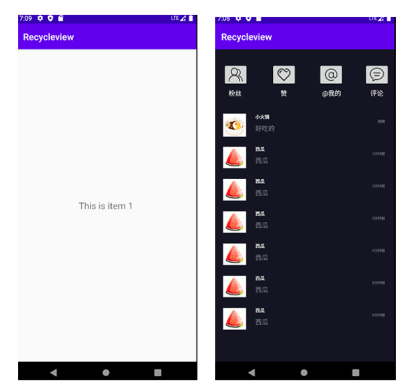
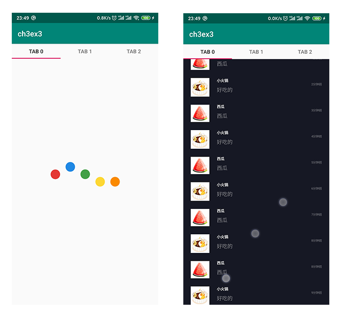
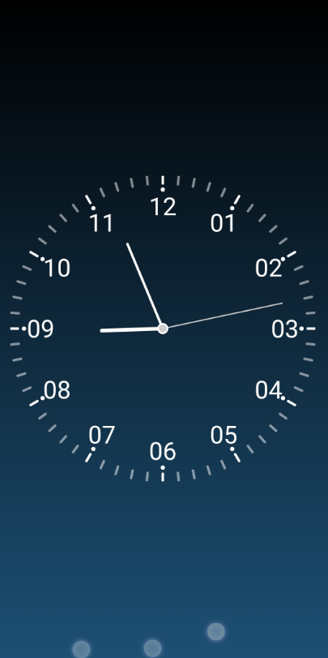
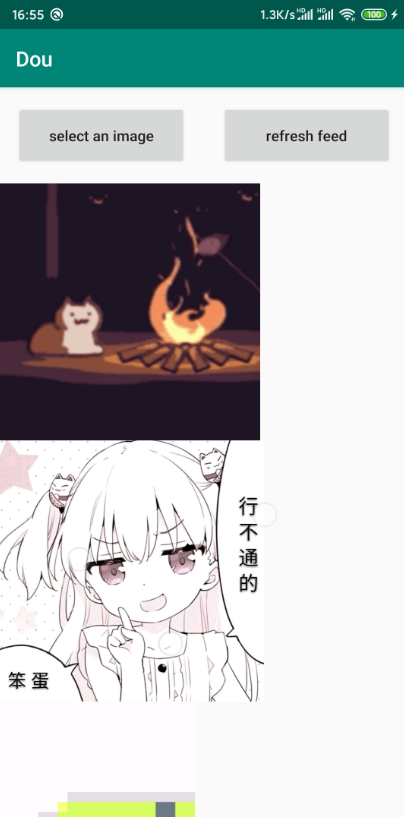
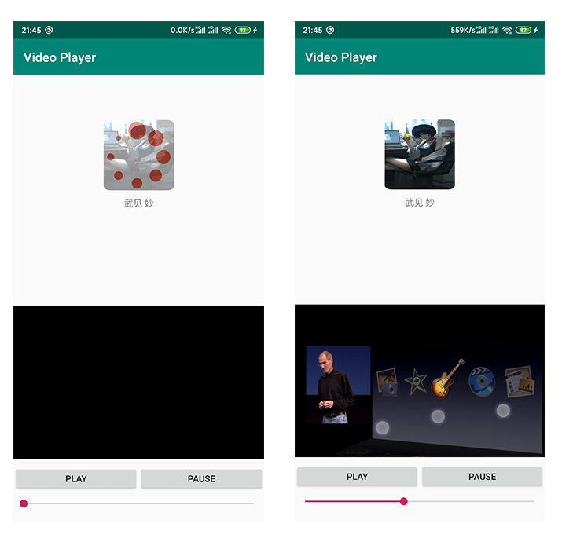
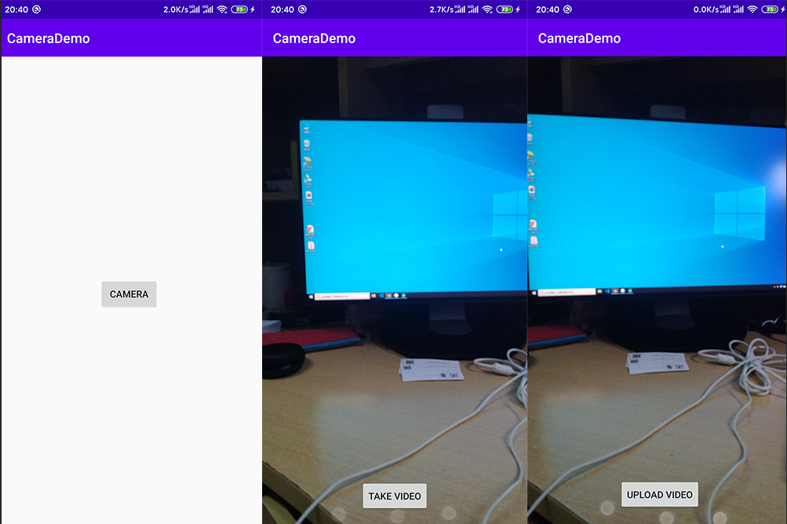

# Android-App-Class
Android App Developing Class Repository

### Day 1

*   实现了两个页面，在主页面有一个没有设计事件的开关，一个文本输入框以及一个按钮。在文本框输入后点即按钮会进入到子页面，子页面会在上方显示在父页面文本框输入的文本，下方插入图片和一个通用控件。
*   用到的组件：`Plain Text, ImageView, Button, ProcessBar, Switch`

### Day 2

*   实现了顶部的四个按钮和`Recycleview`控件，点击每一项会跳转至新建页面，并显示这是第几页。

### Day3

*   按照要求分别实现了3个练习
    *   第一个是控制`Lottie`动画的进度
    *   第二个是使用组和`animation`对`target`进行操作
    *   第三个是使用`TabLayout`和`ViewPager`实现要求布局，经过5s加载动画后，在每个`tab`下加入第二次作业的`recyclerView`组件

### Day4

*   按要求实现了
    *   绘制表针，表针跳动，粗细长短不同
    *   绘制表盘上的数字，用点绘制表盘刻度

### Day 5

*   按要求实现了5个#TODO，实现了上传图片，视频功能，并且能够根据ID对服务器的信息进行筛选，保留用户最新上传的信息。

### Day 6

*   按要求实现了
    *   向数据库中写入查询删除数据
    *   新增项，删除项，完成项，完成项后会置于所有其他未完成项下并标记删除线，再次点击`checkbox`会把已经完成的项再重新恢复为未完成状态并置顶
    *   长按加号后会删除所有记录

### Day 7

*   按要求实现了
    *   从网络加载图片并显示加载占位图，实现图片的圆角显示
    *   从网络加载视频并播放，实现进度条会随播放进度改变，拖动进度条会改变视频播放进度

### Day 8

*   按要求实现了
    *   自定义相机录像
    *   录像后有自动循环播放的预览界面，预览结束后会确认会返回主页面

